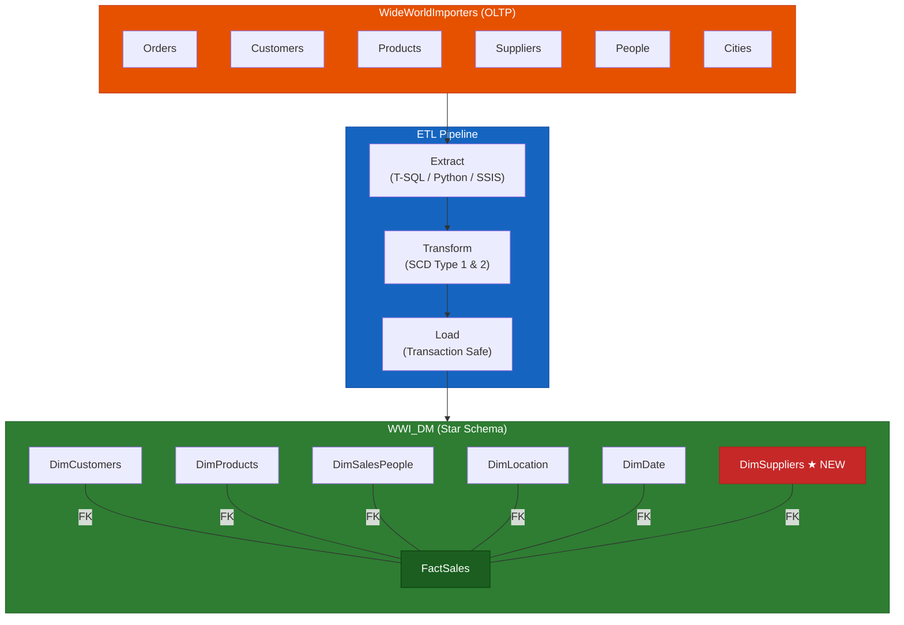
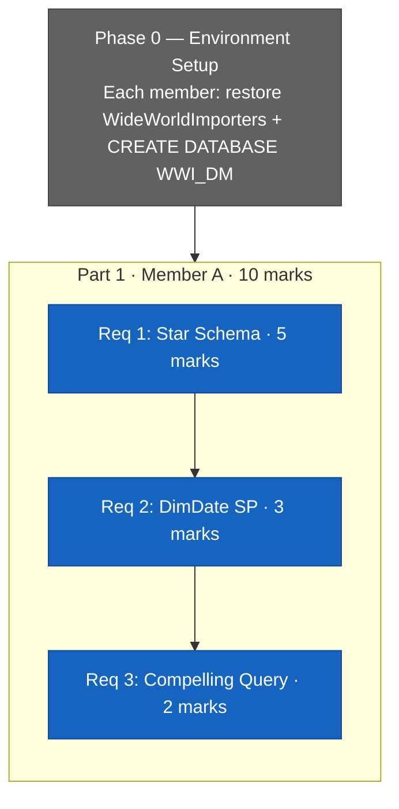
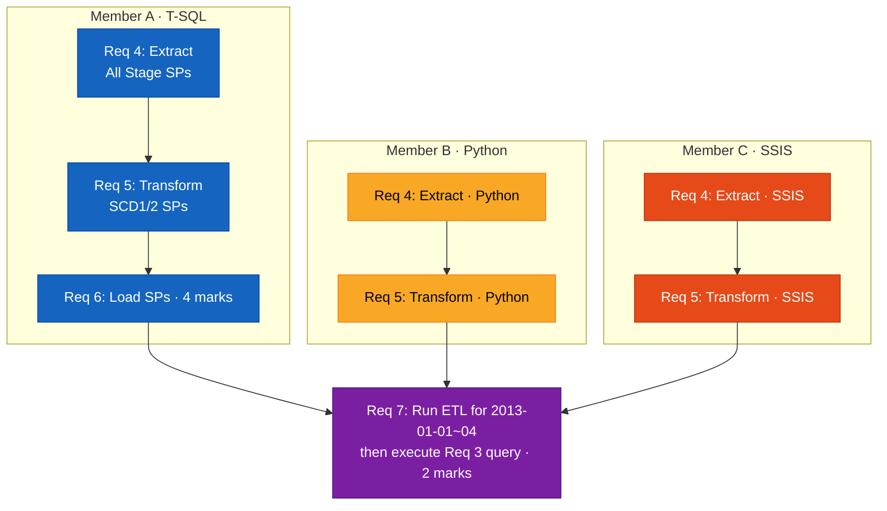

# WWI ETL Pipeline — PROG3240 Assignment 3

**Course:** PROG3240 Business Intelligence (Winter 2026)
**Assignment:** Final Project Assignment 3 (30%)
**Due:** Sunday, Apr 5th @11:59 PM
**Group:** 11

---

## What is this?

WideWorldImporters is a **3NF (write-optimized)** database — designed for daily operations (orders, updates, inserts).
Great for running the business, but terrible for answering analytical questions like "which city buys the most?"
because the data is split across dozens of normalized tables requiring complex JOINs.

This project builds an **ETL pipeline** that converts that 3NF data into a **Star Schema (read-optimized)** Data Mart (WWI_DM) — where analytical queries are fast and simple.

```
3NF (Write-optimized)                    Star Schema (Read-optimized)
WideWorldImporters                       WWI_DM
───────────────────                      ──────────────────
Customers → Cities → StateProvinces      DimCustomers
  → Countries                              CustomerName
4 tables, 3 JOINs to get                   CityName, StateProv, Country
  one customer's location                1 table, 0 JOINs

ETL does the conversion:
  Extract (pull from 3NF with JOINs)
  → Transform (reshape into Star Schema form)
  → Load (insert into DW)
```

## Goal

An automated pipeline that extracts data from WideWorldImporters (3NF) → loads it into an analytical Star Schema DB (WWI_DM)



```
Store Ledger (WideWorldImporters)    →    Business Analysis Report (WWI_DM)
  "Jan 1, John ordered 3 red pens"          "Which products sell best?"
  "Jan 2, Jane ordered 5 blue balls"        "Which cities buy the most?"
                                             "Which supplier's products are popular?"
```

- **Extract** = Pull needed information from the ledger
- **Transform** = Reshape into analysis-friendly format (unify names, map keys, track change history)
- **Load** = Insert into the analysis report DB

---

## Setup (Each team member)

1. Download WideWorldImporters `.bak` from [Microsoft SQL Server Samples](https://github.com/microsoft/sql-server-samples/tree/master/samples/databases/wide-world-importers)
2. Restore in SSMS: Databases → Restore Database → Device → select `.bak`
3. Verify: `USE WideWorldImporters; SELECT COUNT(*) FROM Sales.Orders;`
4. Create target DB: `CREATE DATABASE WWI_DM;`

> Detail: [part0-setup/SETUP-GUIDE.md](part0-setup/SETUP-GUIDE.md)

---

## Project Structure

```
wwi-etl-pipeline/
├── part0-setup/                 # Phase 0: Environment Setup
│   ├── SETUP-GUIDE.md
│   └── setup.sql
│
├── part1/                       # Part 1: Star Schema (10 marks)
│   ├── OVERVIEW.md
│   ├── req1-schema/             # Req 1: Dimensional Model tables (5)
│   │   └── SPEC.md
│   ├── req2-dimdate/            # Req 2: DimDate SP + load (3)
│   │   └── SPEC.md
│   └── req3-query/              # Req 3: Compelling query (2)
│       └── SPEC.md
│
├── part2/                       # Part 2: ETL Pipeline (20 marks)
│   ├── OVERVIEW.md
│   ├── req4-extract/            # Req 4: Extract (6)
│   │   ├── SPEC.md
│   │   ├── t-sql/               # Member A → Part2.sql
│   │   ├── python/              # Member B → Part2.py
│   │   └── ssis/                # Member C → Part2.dtsx
│   ├── req5-transform/          # Req 5: Transform (8)
│   │   ├── SPEC.md
│   │   ├── t-sql/               # Member A → Part2.sql
│   │   ├── python/              # Member B → Part2.py
│   │   └── ssis/                # Member C → Part2.dtsx
│   ├── req6-load/               # Req 6: Load SPs (4)
│   │   └── SPEC.md
│   └── req7-execute/            # Req 7: Execute 4 days + query (2)
│       └── SPEC.md
│
├── submission/                  # Final submission files
│   ├── Part1_Group11.sql
│   ├── Part2_Group11.sql
│   ├── Part2_Group11.py
│   └── Part2_Group11.dtsx
│
└── docs/                        # Assignment PDF
```

---

## Requirements

| Phase | SPEC | Description | Who | Marks |
|-------|------|-------------|-----|-------|
| Phase 0 | [SETUP-GUIDE](part0-setup/SETUP-GUIDE.md) | Environment Setup (WWI restore, DB creation) | All | - |
| **Part 1** | [OVERVIEW](part1/OVERVIEW.md) | **Star Schema Construction** | **A** | **10** |
| Req 1 | [SPEC](part1/req1-schema/SPEC.md) | Dimensional Model tables + DimSuppliers (PKs, FKs, Indexes) | A | 5 |
| Req 2 | [SPEC](part1/req2-dimdate/SPEC.md) | DimDate SP + WHILE Loop 5 years (from CY2012) | A | 3 |
| Req 3 | [SPEC](part1/req3-query/SPEC.md) | Compelling Query — "Predict the Future" (written in Part 1, executed in Req 7) | A | 2 |
| **Part 2** | [OVERVIEW](part2/OVERVIEW.md) | **ETL Pipeline** | | **20** |
| Req 4 | [SPEC](part2/req4-extract/SPEC.md) | Extract: **T-SQL** (A) + **Python** (B) + **SSIS** (C) | A + B + C | 6 |
| Req 5 | [SPEC](part2/req5-transform/SPEC.md) | Transform: **T-SQL** (A) + **Python** (B) + **SSIS** (C) | A + B + C | 8 |
| Req 6 | [SPEC](part2/req6-load/SPEC.md) | Load SPs T-SQL only (Transaction + ROLLBACK) | A | 4 |
| Req 7 | [SPEC](part2/req7-execute/SPEC.md) | Run full ETL for 2013-01-01 ~ 2013-01-04 (4 days), then execute Req 3 query | A | 2 |

---

## Team & Dependency

### Distribution

| Member | Part 1 | Part 2 | Submission file |
|--------|--------|--------|-----------------|
| **A** | Req 1, 2, 3 (all T-SQL) | Req 4 T-SQL + Req 5 T-SQL + Req 6 + Req 7 | `Part1.sql` + `Part2.sql` |
| **B** | — | Req 4 Python + Req 5 Python | `Part2.py` |
| **C** | — | Req 4 SSIS + Req 5 SSIS | `Part2.dtsx` |

### Dependencies

Part 1 must be complete before Part 2 begins. Within Part 2, each member works in parallel in their own technology (T-SQL / Python / SSIS).

**Part 1 — Member A handles all of Part 1**



**Part 2 — Each member implements Req 4 and Req 5 in their own technology**



**Critical Path:** `Phase 0 → Part 1 (Req 1 → 2 → 3) → Part 2 (Req 4 → 5 → 6 → 7)`

---

## Submission

- `Part1_Group11.sql` — Req 1 (DDL) + Req 2 (DimDate SP) + Req 3 (Query)
- `Part2_Group11.sql` — Req 4 T-SQL + Req 5 T-SQL + Req 6 + Req 7
- `Part2_Group11.py` — Req 4 Python + Req 5 Python
- `Part2_Group11.dtsx` — Req 4 SSIS + Req 5 SSIS

**All scripts must execute without errors against WideWorldImporters + WWI_DM.**

---

## Reference

### Course Materials
- **Req 1, 2:** Week 7 PDF (Star Schema, DimDate_Load)
- **Req 4-6:** Week 10 PDF (T-SQL ETL) + Week 9 PDF (SCD)
- **Python:** Lab 6 (pyodbc)
- **SSIS:** Week 10 lecture

### Videos
- [Install SSIS in Visual Studio: Build Your First ETL Task](https://www.youtube.com/watch?v=oqG0g0W9EuU)
- [Create an ETL package with SSIS! // step-by-step](https://www.youtube.com/watch?v=msCJxaA63IA)
- [SCD Type 2 in SSIS Using Lookup](https://www.youtube.com/watch?v=7uj463csru0)
- [SQL ETL Tutorial for Beginners](https://www.youtube.com/watch?v=uy8-0rX-RV8)
