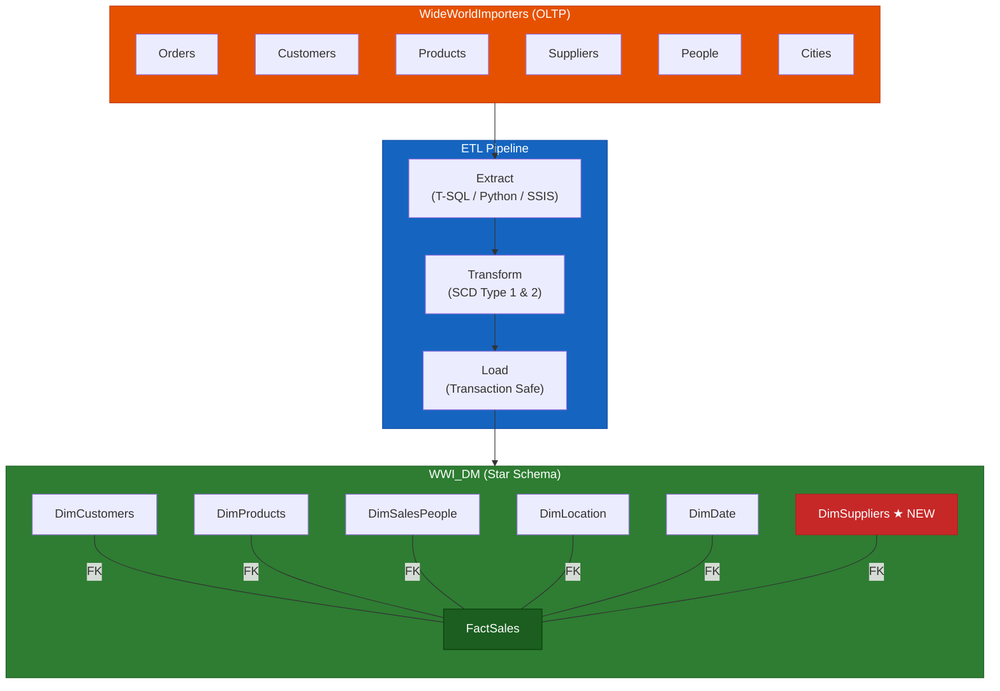
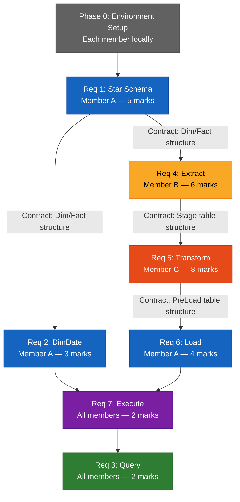

# WWI ETL Pipeline — PROG3240 Assignment 3

**Course:** PROG3240 Business Intelligence (Winter 2026)
**Assignment:** Final Project Assignment 3 (30%)
**Due:** Sunday, Apr 5th @11:59 PM
**Group:** 11

---

## Goal

An automated pipeline that extracts data from WideWorldImporters (store operations DB) → loads it into an analytical Star Schema DB (WWI_DM)



```
Store Ledger (WideWorldImporters)    →    Business Analysis Report (WWI_DM)
  "Jan 1, John ordered 3 red pens"          "Which products sell best?"
  "Jan 2, Jane ordered 5 blue balls"        "Which cities buy the most?"
                                             "Which supplier's products are popular?"
```

- **Extract** = Pull needed information from the ledger
- **Transform** = Reshape into analysis-friendly format (unify names, map keys, track change history)
- **Load** = Insert into the analysis report DB

---

## Setup (Each team member)

1. Download WideWorldImporters `.bak` from [Microsoft SQL Server Samples](https://github.com/microsoft/sql-server-samples/tree/master/samples/databases/wide-world-importers)
2. Restore in SSMS: Databases → Restore Database → Device → select `.bak`
3. Verify: `USE WideWorldImporters; SELECT COUNT(*) FROM Sales.Orders;`
4. Create target DB: `CREATE DATABASE WWI_DM;`

> Detail: [part0-setup/SETUP-GUIDE.md](part0-setup/SETUP-GUIDE.md)

---

## Project Structure

```
wwi-etl-pipeline/
├── part0-setup/                 # Phase 0: Environment Setup
│   ├── SETUP-GUIDE.md
│   └── setup.sql
│
├── part1/                       # Part 1: Star Schema (10 marks)
│   ├── OVERVIEW.md
│   ├── req1-schema/             # Req 1: Dimensional Model tables (5)
│   │   └── SPEC.md
│   ├── req2-dimdate/            # Req 2: DimDate SP + load (3)
│   │   └── SPEC.md
│   └── req3-query/              # Req 3: Compelling query (2)
│       └── SPEC.md
│
├── part2/                       # Part 2: ETL Pipeline (20 marks)
│   ├── OVERVIEW.md
│   ├── req4-extract/            # Req 4: Extract SPs + Python (6)
│   │   └── SPEC.md
│   ├── req5-transform/          # Req 5: Transform SPs + SSIS (8)
│   │   └── SPEC.md
│   ├── req6-load/               # Req 6: Load SPs (4)
│   │   └── SPEC.md
│   └── req7-execute/            # Req 7: Execute 4 days + query (2)
│       └── SPEC.md
│
├── submission/                  # Final submission files
│   ├── Part1_Group11.sql
│   ├── Part2_Group11.sql
│   ├── Part2_Group11.py
│   └── Part2_Group11.dtsx
│
└── docs/                        # Assignment PDF
```

---

## Requirements

| Phase | SPEC | Description | Marks |
|-------|------|-------------|-------|
| Phase 0 | [SETUP-GUIDE](part0-setup/SETUP-GUIDE.md) | Environment Setup (WWI restore, DB creation) | - |
| **Part 1** | [OVERVIEW](part1/OVERVIEW.md) | **Star Schema Construction** | **10** |
| Req 1 | [SPEC](part1/req1-schema/SPEC.md) | Dimensional Model tables + DimSuppliers | 5 |
| Req 2 | [SPEC](part1/req2-dimdate/SPEC.md) | DimDate SP + WHILE Loop 5 years | 3 |
| Req 3 | [SPEC](part1/req3-query/SPEC.md) | Compelling Query ("Predict the Future") | 2 |
| **Part 2** | [OVERVIEW](part2/OVERVIEW.md) | **ETL Pipeline** | **20** |
| Req 4 | [SPEC](part2/req4-extract/SPEC.md) | Extract (Stage + SP + Python + SSIS) | 6 |
| Req 5 | [SPEC](part2/req5-transform/SPEC.md) | Transform (SCD1/2 + PreLoad + SSIS) | 8 |
| Req 6 | [SPEC](part2/req6-load/SPEC.md) | Load (Transaction + ROLLBACK) | 4 |
| Req 7 | [SPEC](part2/req7-execute/SPEC.md) | Execute 4 days + Verification | 2 |

---

## Team & Dependency

### Distribution

```
        Part 1 (Schema)     Part 2 (ETL Pipeline)
        ┌──────────┐    ┌────────┬────────┬────────┐
Mem A:  │ Req 1,2  │    │ Req 6  │ Req 7  │ Integ. │
        │ Tables + │    │ Load   │ Exec   │ Test   │
        │ DimDate  │    │ SP     │ +Query │        │
        └──────────┘    └────────┴────────┴────────┘
Mem B:                   ┌────────────────┐
                         │ Req 4: Extract │ T-SQL + Python
                         │ 5 Stage SPs    │
                         └────────────────┘
Mem C:                   ┌─────────────────┐
                         │ Req 5: Transform│ T-SQL + SSIS
                         │ SCD1/2 + PreLoad│
                         └─────────────────┘
Req 3 (Query):           → All three together (after data is loaded)
```

### Dependencies & Contracts

Each phase **provides table structures as a contract to the next phase**. Code can be written in parallel, but the contracts (table structures) must be agreed upon first.



### Contracts

| Contract | Defined by | Consumed by | Contents | Location |
|----------|-----------|-------------|----------|----------|
| Dim/Fact structure | Member A (Req 1) | All members | Table columns, PK/FK, Index | [req1 SPEC](part1/req1-schema/SPEC.md) |
| Stage structure | Member B (Req 4) | Member C (Req 5) | Stage_* table columns/types | [req4 SPEC](part2/req4-extract/SPEC.md) |
| PreLoad structure | Member C (Req 5) | Member A (Req 6) | PreLoad_* table columns, Sequence | [req5 SPEC](part2/req5-transform/SPEC.md) |

> **Code writing** can be done in parallel once contracts are agreed. **Execution** must follow Req 4 → 5 → 6 sequentially.

**Critical Path:** `Phase 0 → Req 1 → Req 4 → Req 5 → Req 6 → Req 7 → Req 3`

### Timeline
```
Week 1: A completes Req 1,2 → shares DDL with B,C
Week 2: B (Extract), C (Transform) in parallel. A works on Req 6
Week 3: Merge → Integration test → Req 7 + Req 3
```

---

## Submission

- `Part1_Group11.sql` — DDL + DimDate + Query
- `Part2_Group11.sql` — All ETL stored procedures
- `Part2_Group11.py` — Python extract/transform (min 1)
- `Part2_Group11.dtsx` — SSIS package (min 1)

**All scripts must execute without errors against WideWorldImporters + WWI_DM.**

---

## Reference

### Course Materials
- **Req 1, 2:** Week 7 PDF (Star Schema, DimDate_Load)
- **Req 4-6:** Week 10 PDF (T-SQL ETL) + Week 9 PDF (SCD)
- **Python:** Lab 6 (pyodbc)
- **SSIS:** Week 10 lecture

### Videos
- [Install SSIS in Visual Studio: Build Your First ETL Task](https://www.youtube.com/watch?v=oqG0g0W9EuU)
- [Create an ETL package with SSIS! // step-by-step](https://www.youtube.com/watch?v=msCJxaA63IA)
- [SCD Type 2 in SSIS Using Lookup](https://www.youtube.com/watch?v=7uj463csru0)
- [SQL ETL Tutorial for Beginners](https://www.youtube.com/watch?v=uy8-0rX-RV8)
