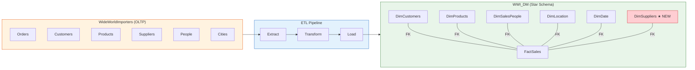
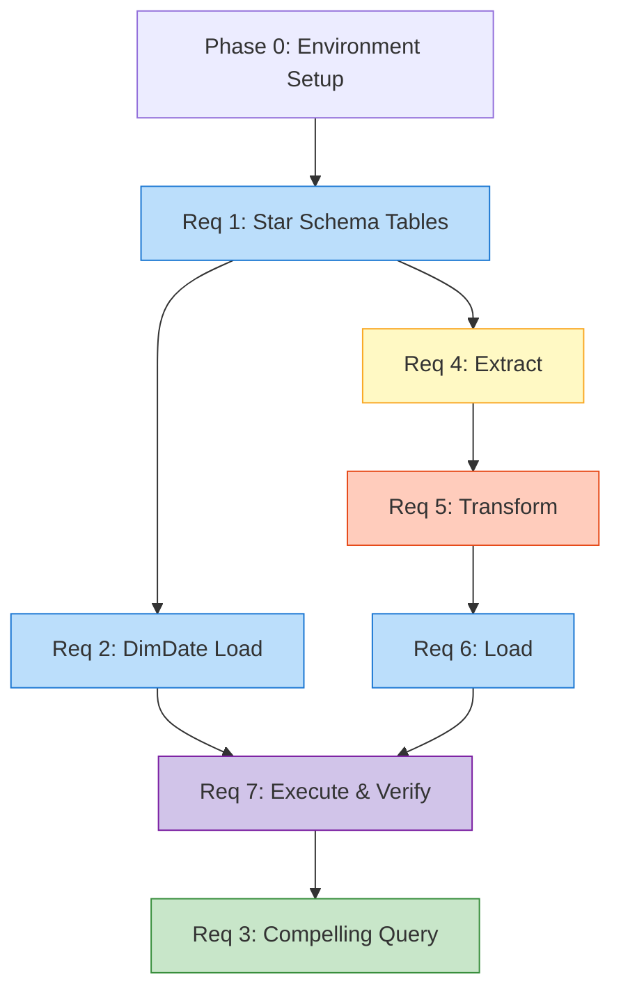

# WWI ETL Pipeline — PROG3240 Assignment 3

**Course:** PROG3240 Business Intelligence (Winter 2026)
**Assignment:** Final Project Assignment 3 (30%)
**Due:** Sunday, Apr 5th @11:59 PM
**Group:** 11

## Overview

WideWorldImporters (OLTP) → WWI_DM (Star Schema Data Mart) ETL Pipeline



## Setup (Each team member)

1. Download WideWorldImporters `.bak` from [Microsoft SQL Server Samples](https://github.com/microsoft/sql-server-samples/tree/master/samples/databases/wide-world-importers)
2. Restore in SSMS: Databases → Restore Database → Device → select `.bak`
3. Verify: `USE WideWorldImporters; SELECT COUNT(*) FROM Sales.Orders;`
4. Create target DB: `CREATE DATABASE WWI_DM;`

## Project Structure

```
wwi-etl-pipeline/
├── part1/                       # Part 1: Star Schema (10 marks)
│   ├── req1-schema/             # Req 1: Dimensional Model tables (5)
│   ├── req2-dimdate/            # Req 2: DimDate SP + load (3)
│   └── req3-query/              # Req 3: Compelling query (2)
│
├── part2/                       # Part 2: ETL Pipeline (20 marks)
│   ├── req4-extract/            # Req 4: Extract SPs + Python (6)
│   ├── req5-transform/          # Req 5: Transform SPs + SSIS (8)
│   ├── req6-load/               # Req 6: Load SPs (4)
│   └── req7-execute/            # Req 7: Execute 4 days + query (2)
│
├── submission/                  # Final submission files
│   ├── Part1_Group11.sql
│   ├── Part2_Group11.sql
│   ├── Part2_Group11.py
│   └── Part2_Group11.dtsx
│
└── docs/                        # Notes & references
```

## Dependency Flow



## Submission

- `Part1_Group11.sql` — DDL + DimDate + Query
- `Part2_Group11.sql` — All ETL stored procedures
- `Part2_Group11.py` — Python extract/transform (min 1)
- `Part2_Group11.dtsx` — SSIS package (min 1)

**All scripts must execute without errors against WideWorldImporters + WWI_DM.**
