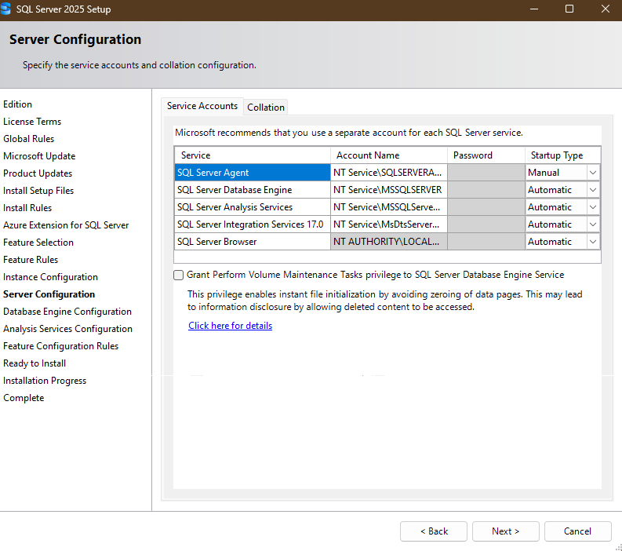
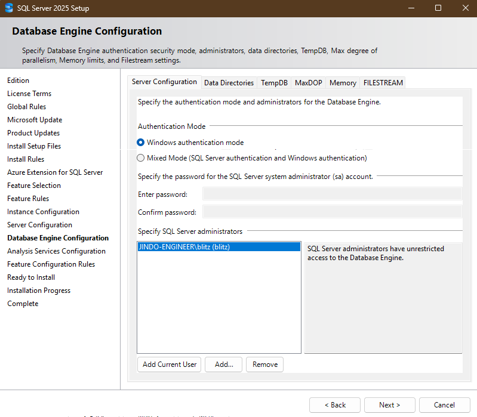
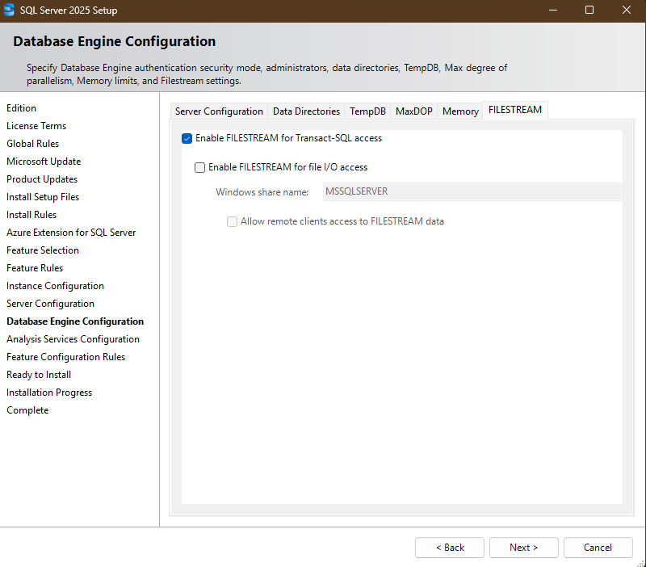
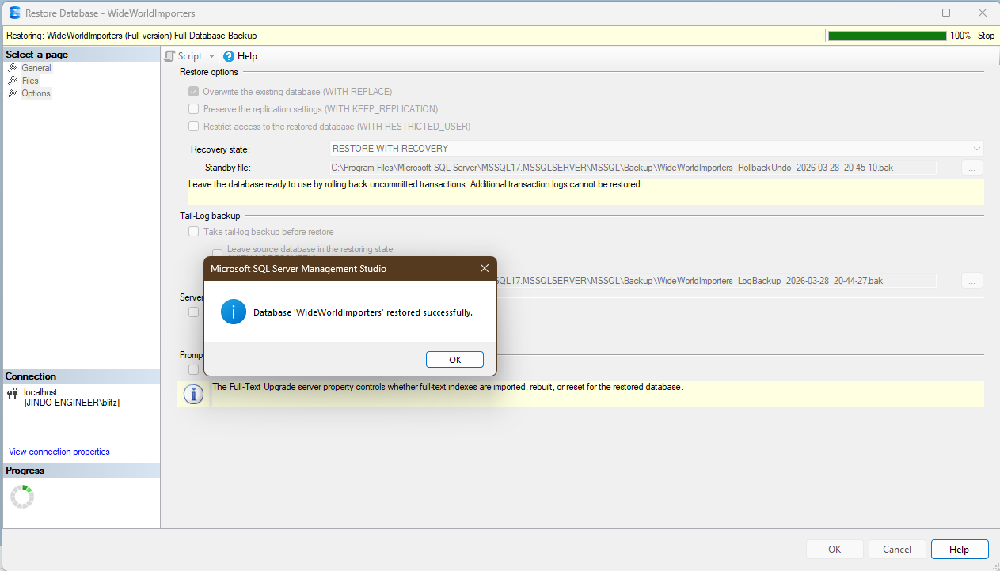
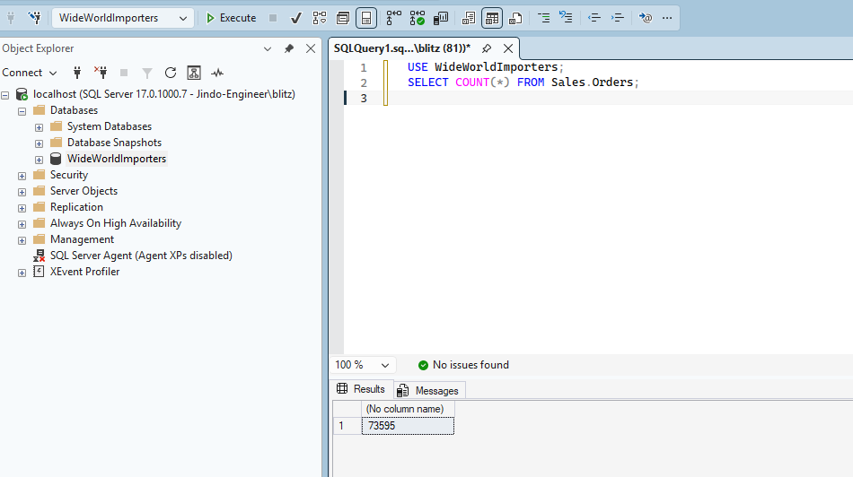
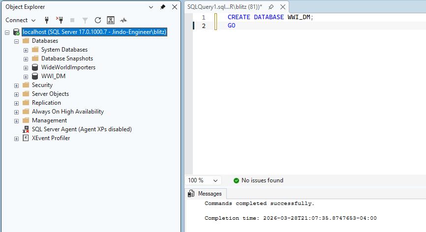

# Phase 0: Environment Setup Guide

> **When complete:** `USE WideWorldImporters; SELECT COUNT(*) FROM Sales.Orders;` returns 73,595 rows, and an empty `WWI_DM` database exists.

## Prerequisites

| Tool | Purpose |
|------|---------|
| SQL Server 2025 **Enterprise Developer Edition** | DB engine — see critical note below |
| SSMS | DB management |
| Visual Studio + SSIS Extension | SSIS package development (Part 2) |
| Python + pyodbc | Python ETL scripts (Part 2) |

---

## ⚠️ Critical: SQL Server Edition

**You must install Enterprise Developer Edition — not Standard Developer Edition.**

Standard Developer Edition cannot restore `WideWorldImporters-Full.bak` due to In-Memory OLTP (XTP) checkpoint incompatibility.

To verify your edition:
```sql
SELECT SERVERPROPERTY('Edition');
-- Expected: Enterprise Developer Edition (64-bit)
```

If you have Standard Developer installed, **Edition Upgrade does not work** — uninstall SQL Server completely and reinstall as Enterprise Developer.

---

## Step 1: Install SQL Server 2025 Enterprise Developer

Download from Microsoft and run **Custom** installation with these options:

- **Edition:** Enterprise Developer
- **Features:** Database Engine Services + Analysis Services + Integration Services
- **Instance:** Default (`MSSQLSERVER`)
- **Authentication:** Windows Authentication + Add Current User as admin
- **FILESTREAM:** Enable for Transact-SQL access (Level 1)







### Verify FILESTREAM is enabled

If SQL Server is already installed, check FILESTREAM level:

```sql
SELECT SERVERPROPERTY('FilestreamConfiguredLevel');
-- 0 = disabled (problem), 1 = T-SQL access (correct), 2 = T-SQL + file I/O
```

If result is `0`, enable via **SQL Server Configuration Manager**:
1. Open SQL Server Configuration Manager
2. SQL Server Services → Right-click `SQL Server (MSSQLSERVER)` → **Properties**
3. **FILESTREAM tab** → Check **"Enable FILESTREAM for Transact-SQL access"**
4. Click **OK** → Restart the SQL Server service

---

## Step 2: Restore WideWorldImporters

1. Download `WideWorldImporters-Full.bak`
   - [GitHub: sql-server-samples](https://github.com/microsoft/sql-server-samples/tree/master/samples/databases/wide-world-importers)
   - Place the file in: `C:\Program Files\Microsoft SQL Server\MSSQL17.MSSQLSERVER\MSSQL\Backup\`

2. SSMS → Right-click **Databases** → **Restore Database...**

3. Device → `...` → Add → Select `.bak` file

4. Click **Files tab** → Check that destination paths point to your server's DATA folder. If paths show `D:\MSSQL13...`, update them to your current instance path.

5. Click **Options tab** → Check **"Overwrite the existing database (WITH REPLACE)"**

6. Click **OK**

**Alternative — SQL (WITH MOVE):**
```sql
RESTORE DATABASE WideWorldImporters
FROM DISK = N'C:\Program Files\Microsoft SQL Server\MSSQL17.MSSQLSERVER\MSSQL\Backup\WideWorldImporters-Full.bak'
WITH MOVE 'WWI_Primary'      TO N'C:\Program Files\Microsoft SQL Server\MSSQL17.MSSQLSERVER\MSSQL\DATA\WideWorldImporters.mdf',
     MOVE 'WWI_UserData'     TO N'C:\Program Files\Microsoft SQL Server\MSSQL17.MSSQLSERVER\MSSQL\DATA\WideWorldImporters_UserData.ndf',
     MOVE 'WWI_Log'          TO N'C:\Program Files\Microsoft SQL Server\MSSQL17.MSSQLSERVER\MSSQL\DATA\WideWorldImporters.ldf',
     MOVE 'WWI_InMemory_Data_1' TO N'C:\Program Files\Microsoft SQL Server\MSSQL17.MSSQLSERVER\MSSQL\DATA\WideWorldImporters_InMemory_Data_1',
     REPLACE;
GO
```



---

## Step 3: Verify Restore

```sql
USE WideWorldImporters;
SELECT COUNT(*) FROM Sales.Orders;
-- Expected: 73,595
```



---

## Step 4: Create WWI_DM

```sql
CREATE DATABASE WWI_DM;
GO
```



---

## Checklist

- [ ] SQL Server 2025 **Enterprise Developer Edition** installed
- [ ] FILESTREAM enabled (Level 1 — T-SQL access)
- [ ] `WideWorldImporters-Full.bak` placed in SQL Server Backup folder
- [ ] WideWorldImporters restored — `SELECT COUNT(*) FROM Sales.Orders` = 73,595
- [ ] `WWI_DM` database created
