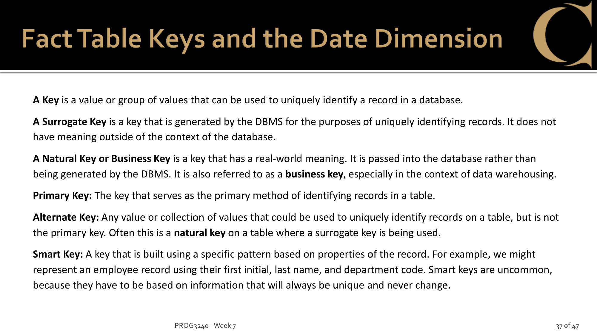
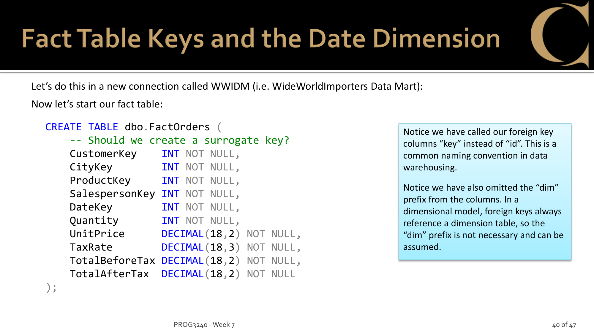
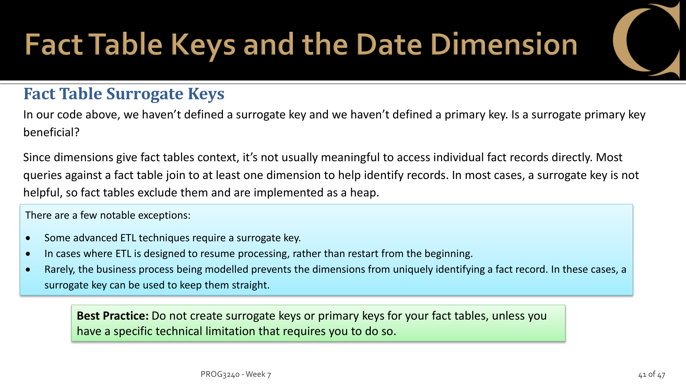
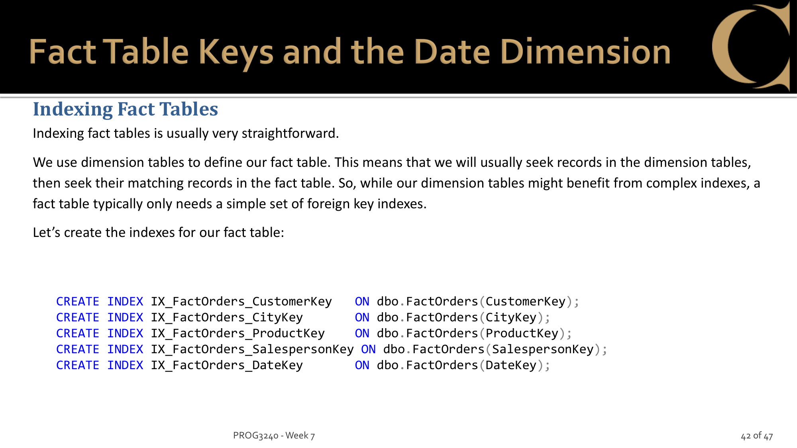
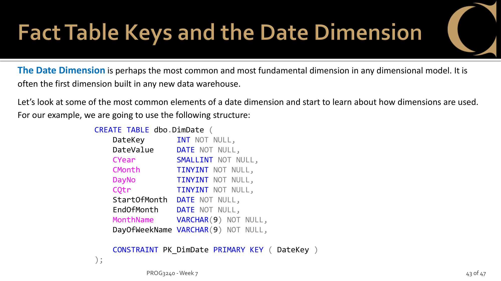
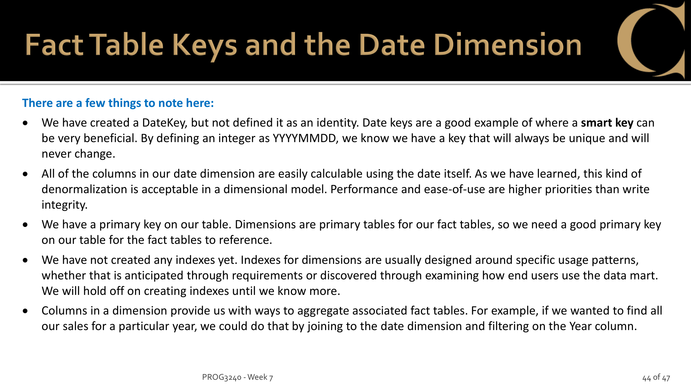

# Req 1: Dimensional Model Tables (5 marks)

> This is the foundation — every other Req builds on the tables created here.

---

## Part A: Concepts — What is a Star Schema?

Before writing any SQL, understand what you're building and why.
Read Week 7 PDF p.4-24 directly. Key concepts:

| Page    | Topic                     | Key Takeaway                                                                  |
| ------- | ------------------------- | ----------------------------------------------------------------------------- |
| p.4     | Data Warehouse definition | Subject-oriented, integrated, time-variant, non-updatable                     |
| p.6     | Data Mart vs DW           | Data Mart = subset focused on one subject (e.g. Sales) — we're building this |
| p.7     | OLTP vs OLAP              | OLTP = normalized, transactional. OLAP = denormalized, read-optimized         |
| p.14-17 | Star Schema               | 1 Fact table (center) + multiple Dimension tables (points) connected by FKs   |
| p.15    | Fact Table                | Contains**measures** (quantitative data): Quantity, UnitPrice, etc.     |
| p.16    | Dimension Table           | Contains**context** (qualitative data): Who? What? Where? When?         |
| p.22-24 | Granularity               | Level of detail. More dimensions = finer grain. All rows same granularity     |

### Questions to answer before moving on

**Q: What is the difference between a Fact table and a Dimension table?**

A Fact table records a business event (e.g. one order). It holds **measures** — numbers you can aggregate with SUM, AVG, COUNT.
A Dimension table gives context to the Fact. It answers "Who? What? Where? When?" — these are the **axes of analysis**.

```
Fact: "Jan 1, John ordered 3 red pens"

  Quantity=3, UnitPrice=500       ← measures (numbers, aggregatable)

  Who?    → DimCustomers (John)
  What?   → DimProducts (red pen)    ← dimensions (context, analysis axes)
  When?   → DimDate (Jan 1)
  Where?  → DimLocation (Toronto)
```

Without dimensions, you have numbers but can't ask questions.
"Which city has the most sales?" → SUM Quantity grouped by DimLocation.

**Q: Why is denormalization acceptable in a Data Warehouse?**

OLTP prioritizes data integrity → normalized to eliminate redundancy.
OLAP (DW) is read-only + query speed matters → redundancy is OK to reduce JOINs and speed up reads.
Writes only happen via ETL batch processes, not during business hours.
(PDF p.6: "optimized for read operations without worrying too much about write operations")

<details>
<summary>Example: normalization vs denormalization</summary>

In OLTP (WideWorldImporters), customer location is normalized across 3 tables:

```
Sales.Customers → DeliveryCityID (FK)
  → Application.Cities → StateProvinceID (FK)
    → Application.StateProvinces → CountryID (FK)
      → Application.Countries
```

To answer "which country does customer X live in?" you need a 4-table JOIN.
This is good for writes (update a country name in one place), but slow for reads.

In OLAP (WWI_DM), the same info is denormalized into one flat table:

```
DimCustomers: CustomerName, DeliveryCityName, DeliveryStateProvCode, DeliveryCountryName
```

Redundant? Yes — "Canada" is stored thousands of times. But no JOINs needed for queries.
This is acceptable because DW data is never updated directly — only refreshed by ETL.

</details>

**Q: What does "granularity" mean for a Fact table?**

Granularity: How specific each row in the Fact table is — the level of detail one row represents.

- Fine grain: "Jan 1, John, Toronto, red pen, 3 units" → more rows, detailed drill-down possible
- Coarse grain: "January, total Toronto sales" → fewer rows, no drill-down

**Key rule:** Fine → coarse (roll-up) is always possible. Coarse → fine (drill-down) is NOT.
So design as fine-grained as possible. (PDF p.23: "You can only drill down if those details exist")
Granularity is determined by the number of connected dimensions — more dims = finer grain.

<details>
<summary>Example: fine grain vs coarse grain</summary>

Same data stored two ways:

**Option A — Fine grain (1 row = 1 order line item):**

```
| Date   | Customer | City    | Product  | Qty |
|--------|----------|---------|----------|-----|
| Jan 1  | John     | Toronto | Red Pen  | 3   |
| Jan 1  | John     | Toronto | Blue Pen | 2   |
| Jan 1  | Jane     | Toronto | Red Pen  | 5   |
| Jan 2  | John     | Toronto | Red Pen  | 1   |
```

4 rows — all questions possible:

- "What did John buy most?" → Red Pen (3+1=4) ✅
- "What sold in Toronto on Jan 1?" → Red Pen 8, Blue Pen 2 ✅

**Option B — Coarse grain (1 row = city monthly total):**

```
| Month   | City    | Qty |
|---------|---------|-----|
| January | Toronto | 11  |
```

1 row — limited questions:

- "Toronto total in January?" → 11 ✅
- "What did John buy?" → unknown ❌ (Customer/Product info is gone)

A → B is possible (just SUM). B → A is impossible — detail is already lost.

Our FactSales uses fine grain: 1 row = one product in one order. 6 dimensions connected = maximum detail.

</details>

---

## Part B: How the class designed WWI's Star Schema

> Full exploration with live queries: **[part-b-explore.ipynb](part-b-explore.ipynb)**

The notebook follows the 4-step dimensional modeling process (Week 7 PDF p.25-36), querying WideWorldImporters directly to verify each step.

| Step | What we did | Key finding |
|------|------------|-------------|
| Step 1 | Find the Fact — Sales schema → Orders + OrderLines | Orders = who/when, OrderLines = what/how much. Together = FactSales source |
| Step 2 | Decide granularity — Order level vs OrderLine level comparison | OrderLine level (fine grain). StockItemID creates the fine grain within each order |
| Step 3 | Define Dimensions — follow FK chains from Orders/OrderLines | 6 Dims: DimCustomers, DimSalesPeople, DimProducts, DimLocation, DimDate, DimSuppliers |
| Step 4 | Define Measures — which numeric columns to aggregate | Quantity, UnitPrice, TaxRate, TotalBeforeTax, TotalAfterTax |
| Step 5 | Result | See Step 3 Summary — 3NF → Star Schema diagram |

Key discoveries during exploration:
- DimLocation exists separately from DimCustomers because the requirement asks for city-level analysis (PDF p.29)
- DimSuppliers discovered via StockItems.SupplierID FK — assignment requires adding it with SCD Type 2
- TotalBeforeTax/TotalAfterTax are calculated values stored for read performance (denormalization)

---

## Part C: From exploration to design — how to build each table

Part B discovered WHAT data we need. Now: HOW to build the actual tables.

> Class SQL slides for reference: [images/](images/) — week7-p37.png through week7-p45.png

### Key types (PDF p.37-38)



| Key type | What it is | Where we use it |
|----------|-----------|-----------------|
| **Surrogate Key** | IDENTITY(1,1), DW-only, no business meaning | All Dims except DimDate |
| **Business Key** | Real-world ID from source (CustomerID, SupplierID) | Kept in Dim for ETL mapping |
| **Smart Key** | Built from data pattern (YYYYMMDD) | DimDate only |

### SCD — Slowly Changing Dimensions (Week 9 PDF)

When a Dim attribute changes (e.g. supplier changes name), what do you do?

| Type | Action | Example | Use case |
|------|--------|---------|----------|
| **Type 0** | Never changes | Dates — 2013-01-01 is always Tuesday | Data that is factually permanent |
| **Type 1** | Overwrite | Old name gone, only new name | Changes possible but history doesn't matter |
| **Type 2** | Keep both — expire old, add new | Both old and new records exist with `StartDate`/`EndDate` | "What was the value when this fact happened?" |

How the class applied each type (Week 9 PDF p.14-17):

| Dim | SCD Type | Reasoning (from PDF) | Extra columns |
|-----|----------|---------------------|---------------|
| DimDate | Type 0 | All columns derived from DateValue — can never change (p.7) | None |
| DimLocation | Type 1 | "does not seem likely that changes would alter the meaning of associated facts" (p.15) | None |
| DimSalesPeople | Type 1 | "debatable whether changes would impact associated facts" (p.17) | None |
| DimCustomers | **Type 2** | "changes would definitely alter the interpretation of associated facts" (p.16) | `StartDate`, `EndDate` |
| DimProducts | **Type 2** | "would alter the interpretation of associated facts" (p.16) | `StartDate`, `EndDate` |
| DimSuppliers | **Type 2** | Assignment: "if non-key attributes change, they would impact associated facts" | `StartDate`, `EndDate` |

### Table design — based on Part B findings

**FactSales**





- Part B found: Orders(who/when) + OrderLines(what/how much) = Fact source
- No PK, no surrogate key — Fact is a heap (p.41: users access Facts through Dims, not directly)
- 6 FK columns: `CustomerKey`, `LocationKey`, `ProductKey`, `SalespersonKey`, `SupplierKey`, `DateKey`
- 5 measures: `Quantity`, `UnitPrice`, `TaxRate`, `TotalBeforeTax`, `TotalAfterTax`
- 1 non-clustered index per FK (p.42)

<details>
<summary>What is a non-clustered index?</summary>

SQL Server has two types of index:
- **Clustered** = table data itself is sorted in that order. Only 1 per table. Usually auto-created on PK.
- **Non-clustered** = separate lookup list. Data stays untouched. Multiple allowed.

```
Clustered = phone book
  → pages are physically sorted by name (A-Z)
  → only 1 possible (can't be sorted by name AND address at the same time)

Non-clustered = book's back-of-book index
  → "Star Schema → p.14, p.17, p.36"
  → actual pages stay in original order, just a separate lookup
  → multiple possible (term index, person index, topic index...)
```

FactSales has no PK → no clustered index (it's a heap). 6 non-clustered indexes let SQL Server quickly find rows by any FK.

</details>

**DimCustomers**
- Part B found: Customers + CustomerCategories (+ Cities chain)
- Surrogate Key: `CustomerKey` IDENTITY(1,1)
- Columns: `CustomerName`, `CustomerCategoryName`, delivery/postal city info
- Logically, location is redundant here — FactSales has `LocationKey` → DimLocation separately
- But class SQL (Week 9 p.18) includes location in DimCustomers, so we follow it
- **SCD Type 2** — Week 9 PDF p.16: "changes would definitely alter the interpretation of associated facts"
- Extra columns: `StartDate`, `EndDate`

**DimSalesPeople**
- Part B found: People filtered by IsSalesperson=1, no FK chain
- Surrogate Key: `SalespersonKey` IDENTITY(1,1)
- Columns: `FullName`, `PreferredName`, `LogonName`, `PhoneNumber`, `FaxNumber`, `EmailAddress`
- **SCD Type 1** (overwrite) — Week 9 PDF p.17: "debatable whether changes would impact associated facts"
- No extra columns needed

**DimProducts**
- Part B found: StockItems + Colors, nullable ColorID/Brand/Size
- Surrogate Key: `ProductKey` IDENTITY(1,1)
- Columns: `ProductName`, `ProductColour` (NULL allowed), `ProductBrand` (NULL allowed), `ProductSize` (NULL allowed)
- **SCD Type 2** — Week 9 PDF p.16: "would alter the interpretation of associated facts"
- Extra columns: `StartDate`, `EndDate`

**DimLocation**
- Part B found: Cities → StateProvinces → Countries chain
- Surrogate Key: `LocationKey` IDENTITY(1,1)
- Columns: `CityName`, `StateProvCode`, `StateProvName`, `CountryName`, `CountryFormalName`
- **SCD Type 1** — Week 9 PDF p.15: "does not seem likely that changes would alter the meaning of associated facts"
- No extra columns needed

**DimDate**




- Part B found: calculated, no source table
- Smart Key: `DateKey` = YYYYMMDD integer (NOT IDENTITY)
- Columns: `DateValue`, `CYear`, `CMonth`, `DayNo`, `CQtr`, `StartOfMonth`, `EndOfMonth`, `MonthName`, `DayOfWeekName`
- SCD Type 0 — dates never change
- Data loaded via stored procedure (Req 2)

**DimSuppliers** (assignment addition)
- Part B found: Suppliers + SupplierCategories, SupplierID = business key
- Surrogate Key: `SupplierKey` IDENTITY(1,1)
- Business Key: `FullName` (same pattern as DimCustomers using CustomerName)
- Columns: `FullName`, `PhoneNumber`, `FaxNumber`, `WebsiteURL`, `SupplierCategoryName`
- **SCD Type 2**: `StartDate`, `EndDate` (Week 9 PDF naming convention, p.12)
  - Assignment says: "if non-key attributes change, they would impact associated facts"
  - This means: if supplier changes name or category, keep BOTH old and new records
  - `StartDate` = when this record became active
  - `EndDate` = when expired (NULL = still active)

---

## Part D: What the assignment adds — DimSuppliers

> DimSuppliers source tables already explored in **[part-b-explore.ipynb](part-b-explore.ipynb)** Step 3 → DimSuppliers section.

### Summary from notebook exploration

- Source: `Purchasing.Suppliers` + `Purchasing.SupplierCategories` (2 tables → 1 Dim)
- Business Key: `FullName` (same pattern as DimCustomers using CustomerName)
- Columns: `FullName`, `PhoneNumber`, `FaxNumber`, `WebsiteURL`, `SupplierCategoryName`
- SCD Type 2: `StartDate`, `EndDate` (Week 9 naming convention — see Part C above)

### Assignment requirements

> "Review the source of the Supplier table to determine the unique/business key"
→ `SupplierID` (confirmed via FK in notebook)

> "add the SupplierCategoryName field to the appropriate table"
→ JOIN `Purchasing.SupplierCategories` on `SupplierCategoryID` (confirmed via FK in notebook)

> "set the SCD level appropriately"
→ SCD Type 2 (see Part C)

---

## Part E: Build it

After understanding Parts A-D, write the SQL.

### What to create

1. All Dim tables (DimLocation, DimCustomers, DimProducts, DimSalesPeople, DimDate) — based on class SQL
2. DimSuppliers — new, designed from Part D exploration
3. FactSales — based on class FactOrders, with SupplierKey added
4. FK constraints from FactSales to each Dim
5. One index per FK on FactSales

### Verify

```sql
-- All tables exist?
SELECT TABLE_NAME FROM WWI_DM.INFORMATION_SCHEMA.TABLES ORDER BY TABLE_NAME;
-- Expected: DimCustomers, DimDate, DimLocation, DimProducts, DimSalesPeople, DimSuppliers, FactSales

-- DimSuppliers structure looks right?
SELECT COLUMN_NAME, DATA_TYPE FROM WWI_DM.INFORMATION_SCHEMA.COLUMNS
WHERE TABLE_NAME = 'DimSuppliers';

-- FactSales has all FKs?
SELECT CONSTRAINT_NAME FROM WWI_DM.INFORMATION_SCHEMA.TABLE_CONSTRAINTS
WHERE TABLE_NAME = 'FactSales' AND CONSTRAINT_TYPE = 'FOREIGN KEY';

-- Star Schema visible in Database Diagram?
-- SSMS → WWI_DM → Database Diagrams → New → Add all tables
```
