# Req 4: Extract (6 marks)

> Extract = pull data from WideWorldImporters (3NF) into Stage tables in WWI_DM.

---

## What is Extract?

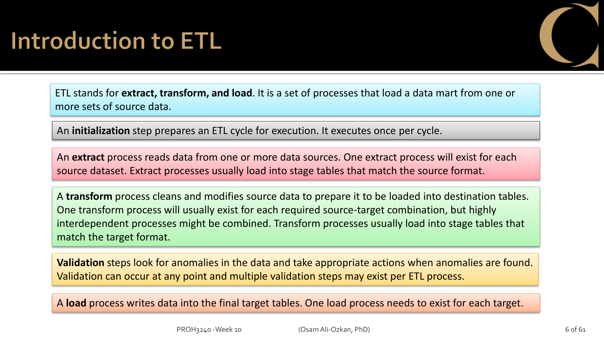
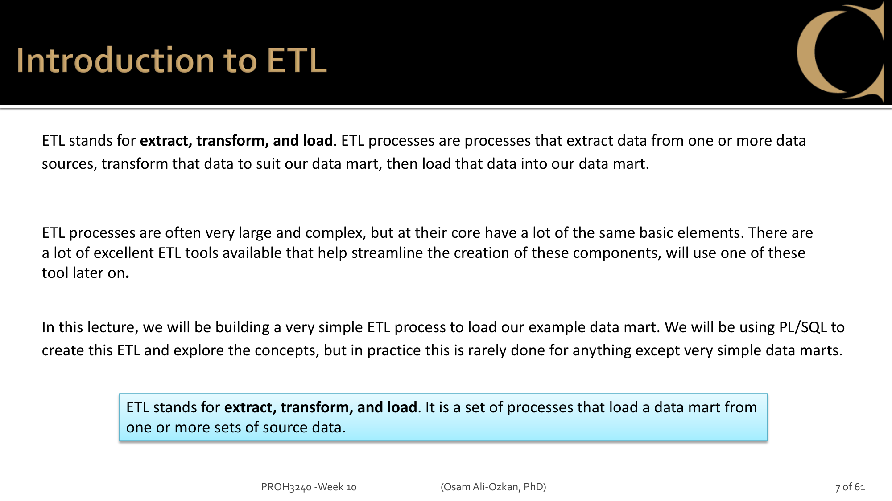

In [Part B notebook](../../part1/req1-schema/part-b-explore.ipynb), we explored WideWorldImporters and found the source tables for each Dim.
But we can't transform 3NF data directly into Star Schema — it's too messy (13+ tables, FK chains).

Extract is the first step: **copy the relevant source data into flat Stage tables** in our DW database.

```
WideWorldImporters (3NF)          WWI_DM
┌────────────────────┐            ┌──────────────────┐
│ Customers          │            │                  │
│ CustomerCategories │  Extract   │ Customers_Stage  │ ← flat, no PKs
│ Cities             │ ────────→  │ Products_Stage   │ ← no constraints
│ StateProvinces     │  (JOIN +   │ SalesPeople_Stage│ ← just raw data
│ Countries          │   INSERT)  │ Orders_Stage     │
│ StockItems, Colors │            │ Suppliers_Stage  │
│ People             │            │                  │
│ Suppliers          │            └──────────────────┘
│ Orders, OrderLines │
└────────────────────┘
```

Why Stage tables instead of going directly to Dims?

- Don't want to hold connections to source DB during long Transform operations
- If Transform fails, source data is safe in Stage — just re-transform
- Stage = snapshot of source at extraction time

## ETL Process Planning

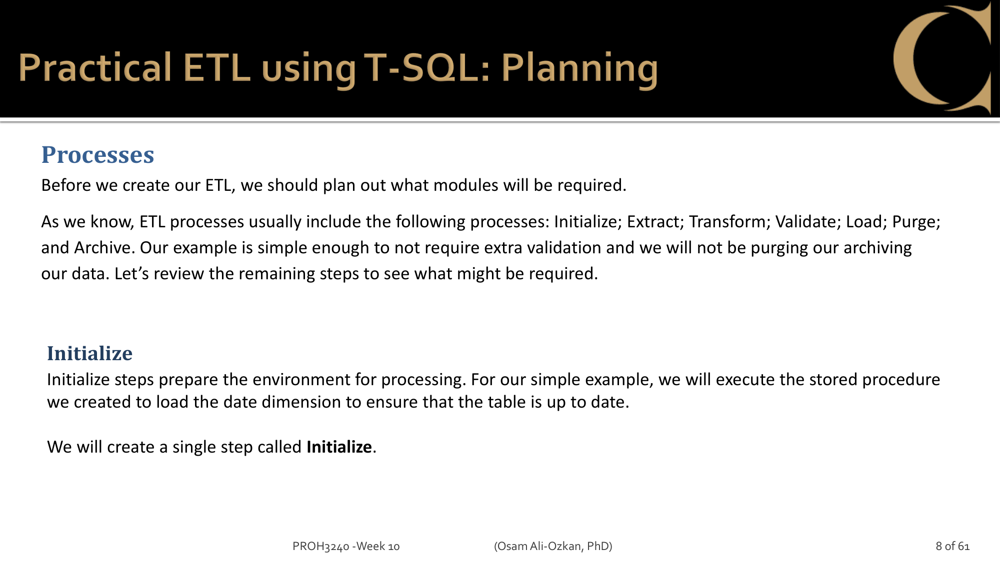
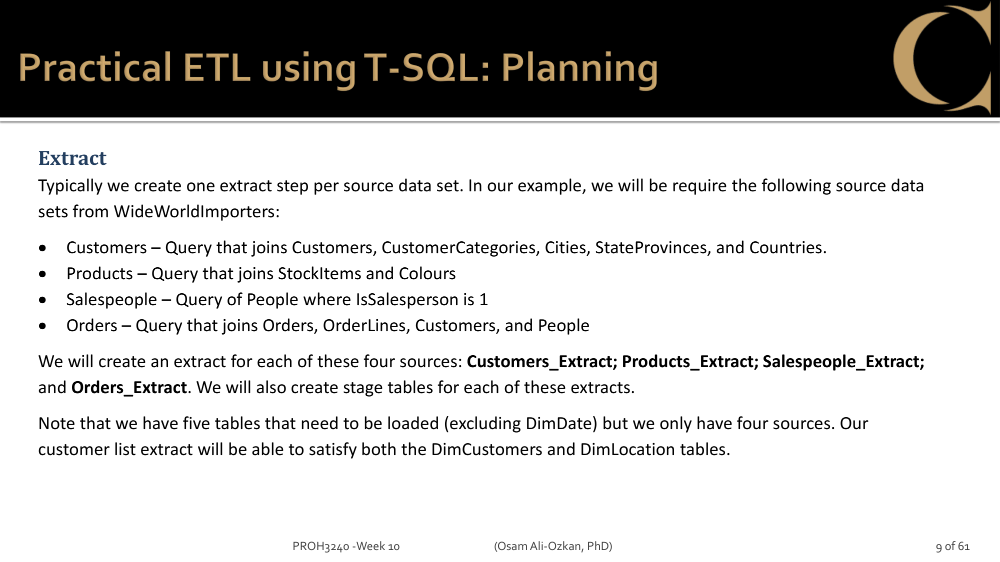
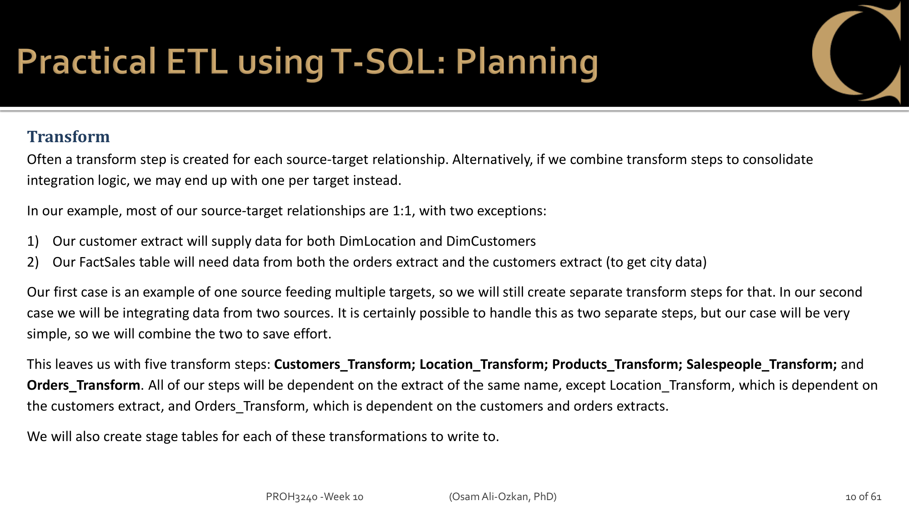
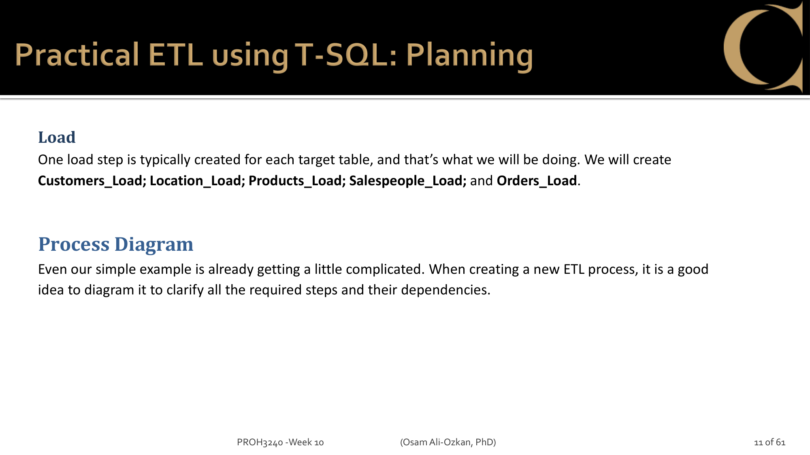

## ETL Process Diagram

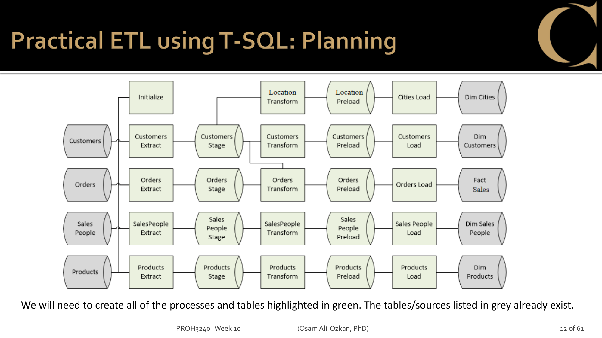
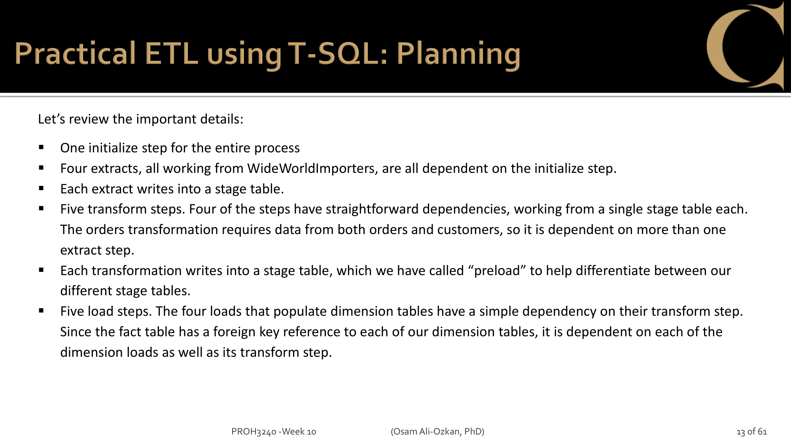

## Stage Table Design

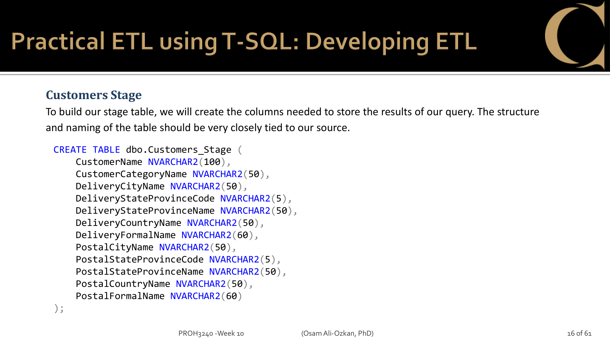
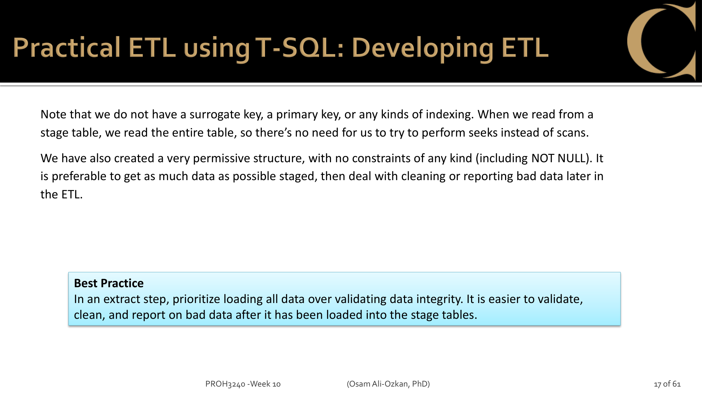

Stage tables are intentionally simple:

- **No PK, no constraints, no indexes** — just columns to hold the JOINed data
- **No surrogate keys** — Stage uses business keys from source
- **Permissive** — NULLs allowed everywhere. Load all data first, validate later.

## What to Extract (from [Part B notebook](../../part1/req1-schema/part-b-explore.ipynb))

| # | Stage Table       | Source Tables (3NF)                           | What it flattens    | Used by                    |
| - | ----------------- | --------------------------------------------- | ------------------- | -------------------------- |
| 1 | Customers_Stage   | Customers + CustomerCategories + Cities chain | 8 tables → 1 flat  | DimCustomers + DimLocation |
| 2 | Products_Stage    | StockItems + Colors                           | 2 tables → 1 flat  | DimProducts                |
| 3 | SalesPeople_Stage | People (WHERE IsSalesperson=1)                | 1 table filtered    | DimSalesPeople             |
| 4 | Orders_Stage      | Orders + OrderLines + Customers + People      | 4+ tables → 1 flat | FactSales                  |
| 5 | Suppliers_Stage   | Suppliers + SupplierCategories                | 2 tables → 1 flat  | DimSuppliers               |

Note: Customers_Stage serves **both** DimCustomers and DimLocation (one extract, two transforms).

## Extract SP Pattern

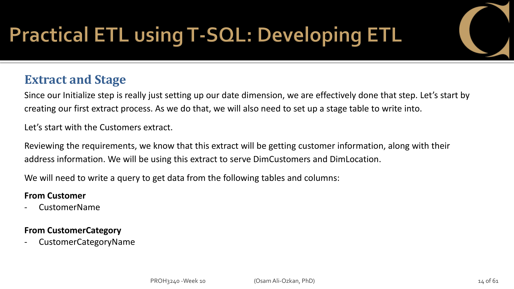
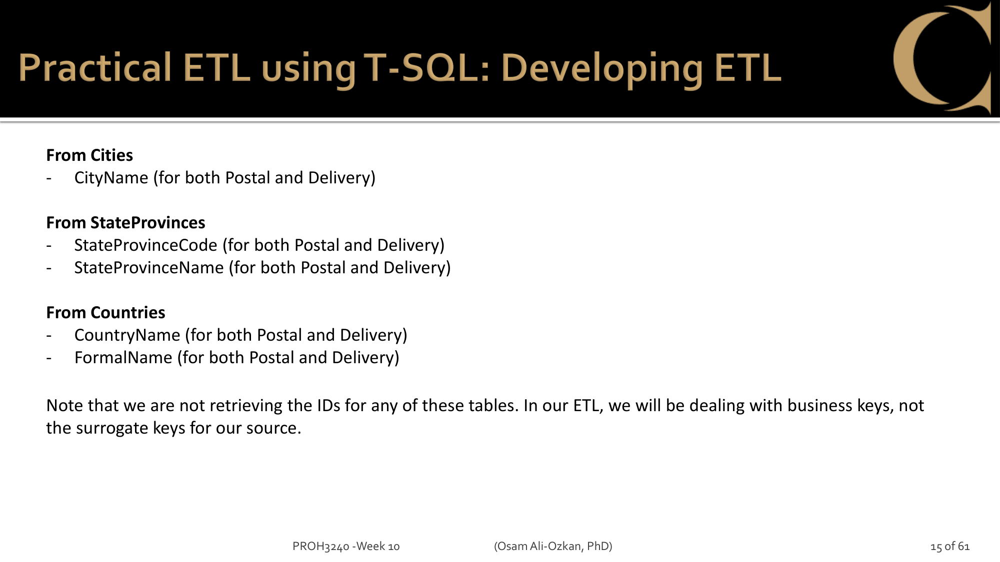

Every Extract SP follows the same pattern:

1. `TRUNCATE` the Stage table (fresh start each run)
2. `INSERT INTO Stage ... SELECT ... FROM source JOINs`
3. Check `@@ROWCOUNT` — if 0, raise error (validation)

---

## T-SQL (Member A)

5 Stored Procedures, one per Stage table.

**Customers_Extract** — class example:

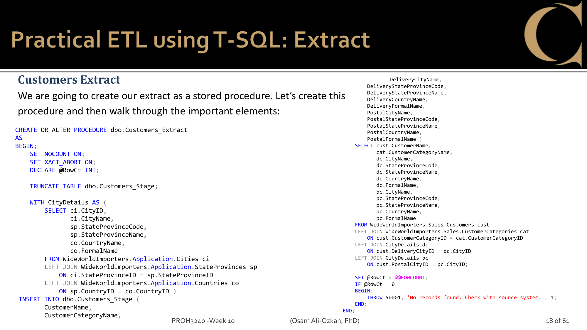

- CTE for Cities chain (Cities + StateProvinces + Countries)
- JOIN Customers + CustomerCategories + CTE (delivery) + CTE (postal)
- INSERT INTO Customers_Stage

**Orders_Stage + Extract** — class example:

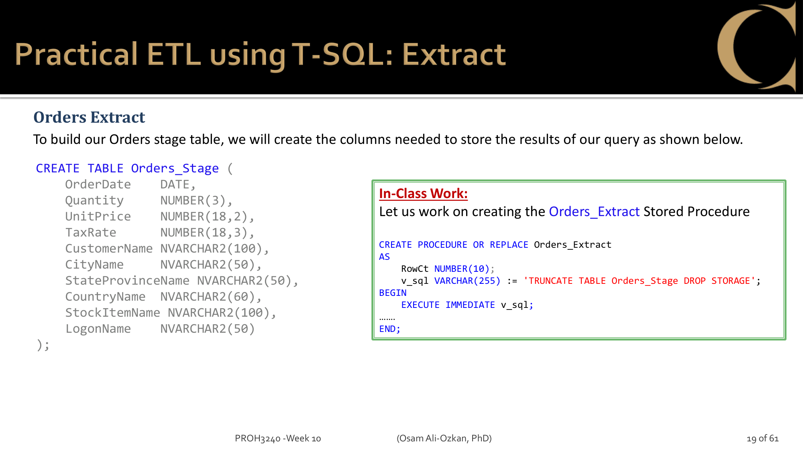

**Products_Extract, SalesPeople_Extract, Orders_Extract** — homework:

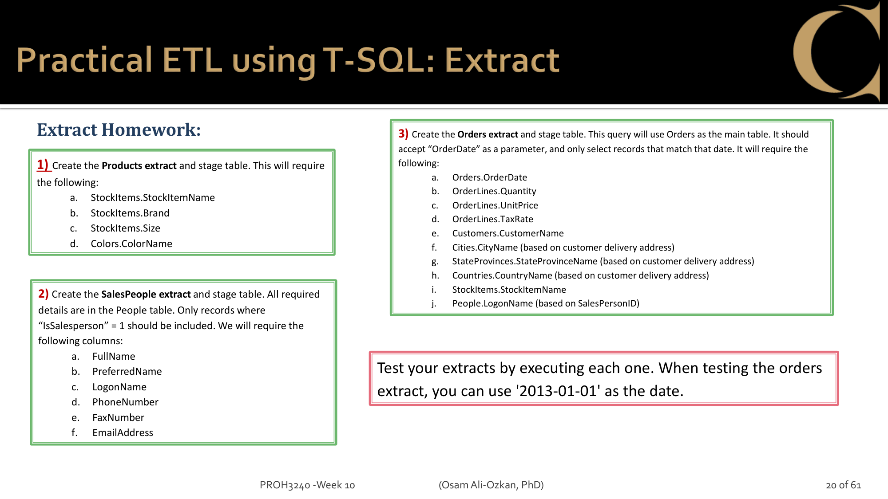

**Suppliers_Extract** — assignment addition (not in class):

- Suppliers + SupplierCategories JOIN
- Columns: SupplierName, PhoneNumber, FaxNumber, WebsiteURL, SupplierCategoryName
- Follow the same pattern as Customers_Extract

Test: Execute each SP, then `SELECT TOP 5 * FROM [Stage table]`. Use '2013-01-01' for Orders.

---

## Python (Member B)

Same logic as T-SQL, but using pyodbc:

1. Connect to WideWorldImporters (source) — read data with SELECT
2. Connect to WWI_DM (target) — TRUNCATE Stage table, INSERT rows
3. Same JOINs, same columns, just executed via Python

```python
# Pattern (from Lab 6):
import pyodbc
conn_source = pyodbc.connect(...)  # WideWorldImporters
conn_target = pyodbc.connect(...)  # WWI_DM

cursor_source = conn_source.cursor()
cursor_source.execute("SELECT ... FROM ... JOIN ...")
rows = cursor_source.fetchall()

cursor_target = conn_target.cursor()
cursor_target.execute("TRUNCATE TABLE Customers_Stage")
for row in rows:
    cursor_target.execute("INSERT INTO Customers_Stage VALUES (?, ?, ...)", row)
conn_target.commit()
```

At least 1 Extract must be implemented in Python.

---

## SSIS (Member C)

Same logic, but using Visual Studio GUI:

1. Create Integration Services Project
2. Data Flow Task: OLE DB Source (WideWorldImporters query) → OLE DB Destination (Stage table)
3. Connection Manager: localhost, Trust Server Certificate

At least 1 Extract must be implemented in SSIS.
