# Req 5: Transform (8 marks)

> Transform = convert Stage data (source format) into PreLoad data (Star Schema format).

---

## What is Transform?

Extract gave us flat copies of source data in Stage tables. But Stage data still uses **business keys** (CustomerName, StockItemName) — our Star Schema uses **surrogate keys** (CustomerKey, ProductKey).

Transform does:
1. **Map business keys → surrogate keys** (look up or create)
2. **Handle SCD** (Type 1: overwrite, Type 2: expire old + add new)
3. **Aggregate measures** for FactSales
4. Write results into **PreLoad tables** (same structure as final Dim/Fact, but temporary)

```
WWI_DM
┌──────────────────┐              ┌──────────────────┐              ┌──────────────────┐
│ Customers_Stage  │  Transform   │ Customers_Preload│    Load      │ DimCustomers     │
│ (business keys)  │ ──────────→  │ (surrogate keys) │ ──────────→  │ (final)          │
│ CustomerName     │  SCD logic   │ CustomerKey      │              │ CustomerKey      │
│ CityName         │  + key map   │ CustomerName     │              │ CustomerName     │
└──────────────────┘              └──────────────────┘              └──────────────────┘
```

## PreLoad Table Design

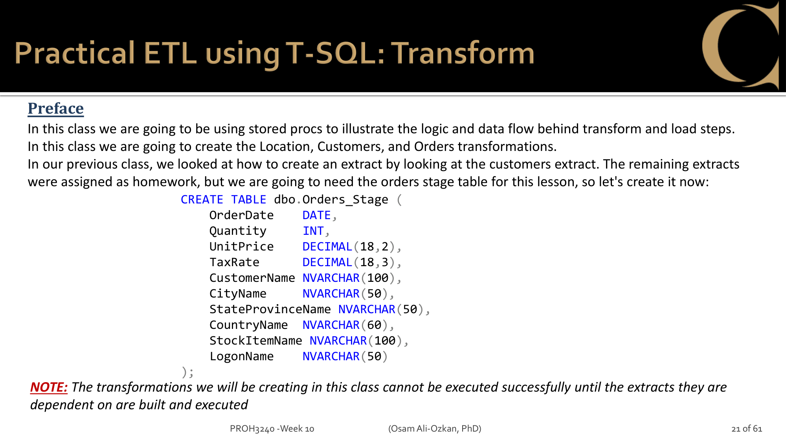
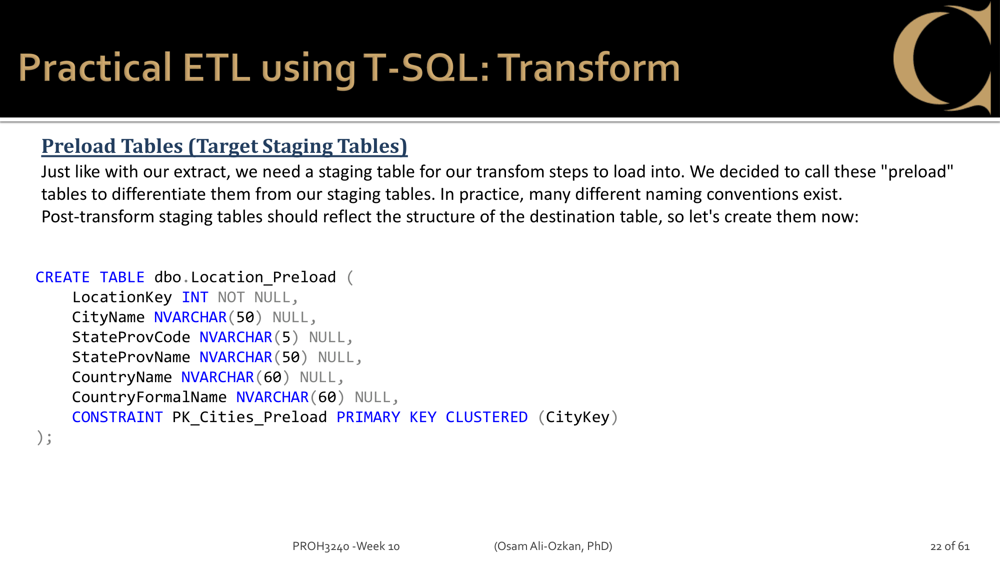
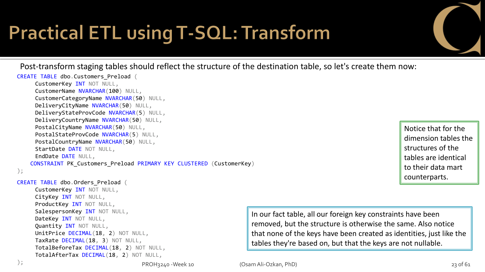

PreLoad tables = **same structure as destination Dim/Fact**, but:
- No FK constraints (just data staging)
- Keys are NOT IDENTITY — filled by Transform logic (Sequence or existing key)
- Temporary — TRUNCATEd at the start of each Transform

## Sequence — why not IDENTITY?

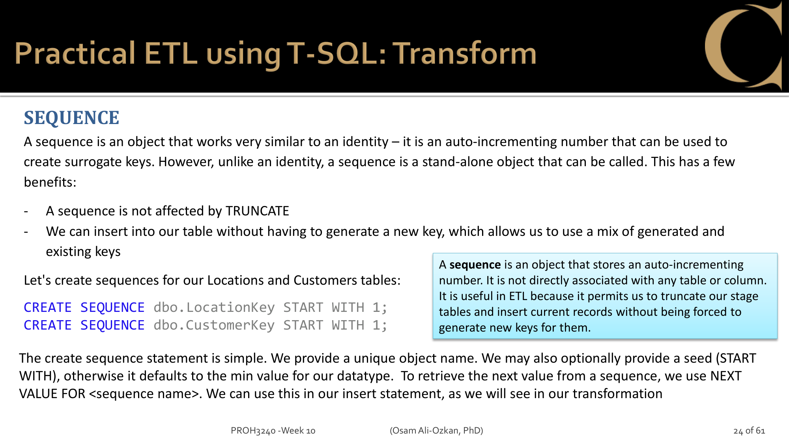

Dim tables use IDENTITY for surrogate keys. But PreLoad tables can't — because:
- We TRUNCATE PreLoad every run
- We need to mix **existing** keys (already in DW) with **new** keys (just created)
- IDENTITY would reset or conflict

Solution: **Sequence** — a standalone counter that isn't affected by TRUNCATE:
```sql
CREATE SEQUENCE dbo.LocationKey START WITH 1;
-- New record: NEXT VALUE FOR dbo.LocationKey → gets next number
-- Existing record: use the surrogate key already in the Dim table
```

## SCD in Transform

This is where SCD types actually matter:

### Type 1 (DimLocation, DimSalesPeople)

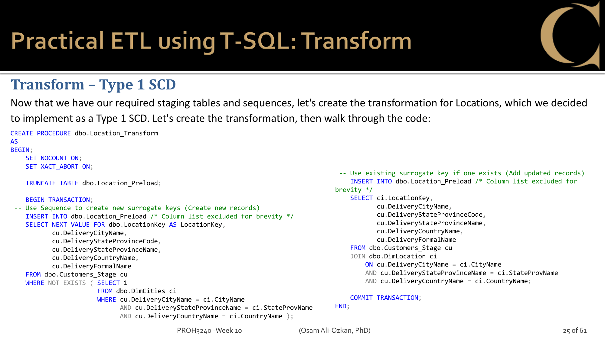
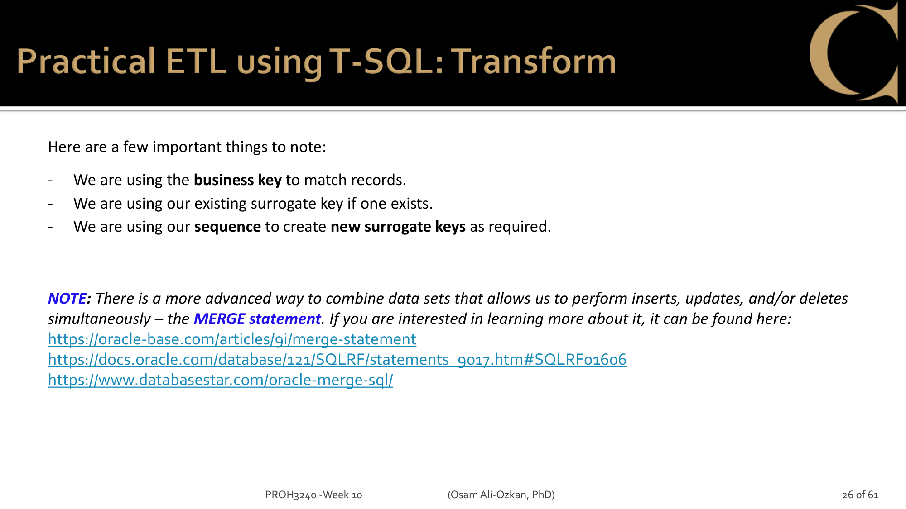

- New record (not in DW)? → Sequence for new key, INSERT
- Existing record? → Use existing surrogate key, overwrite attributes

### Type 2 (DimCustomers, DimProducts, DimSuppliers)

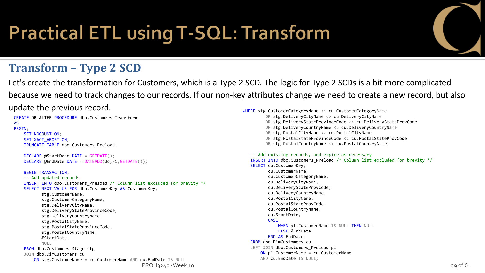
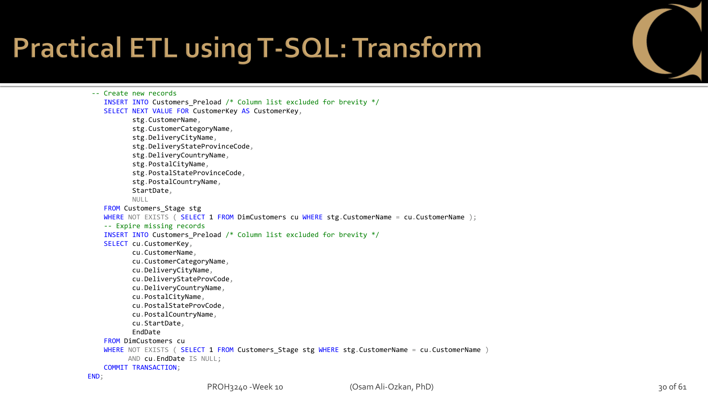
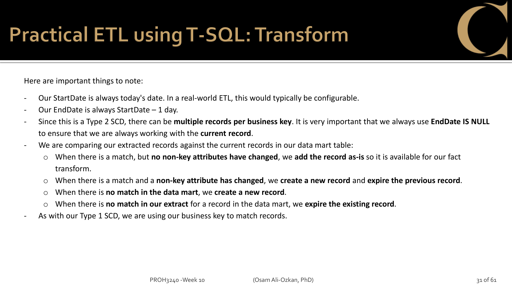

4 cases to handle:

| Case | Condition | Action |
|------|-----------|--------|
| a | Match, no attribute change | Keep as-is (add to PreLoad unchanged) |
| b | Match, attribute changed | New record (Sequence) + expire old (set EndDate) |
| c | New (not in DW) | New record (Sequence), StartDate = today |
| d | Missing (in DW but not in Stage) | Expire (set EndDate) |

> "always use EndDate IS NULL to ensure that we are always working with the current record"

### MERGE statement (alternative approach)

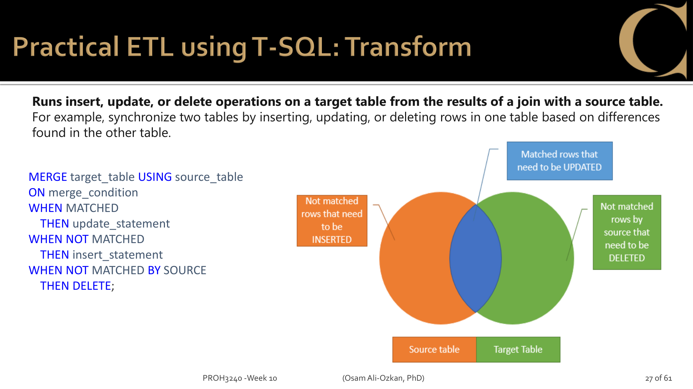
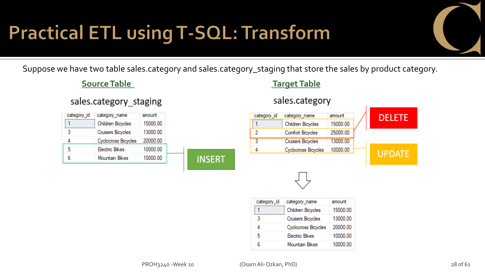

### PreLoad tables for remaining transforms

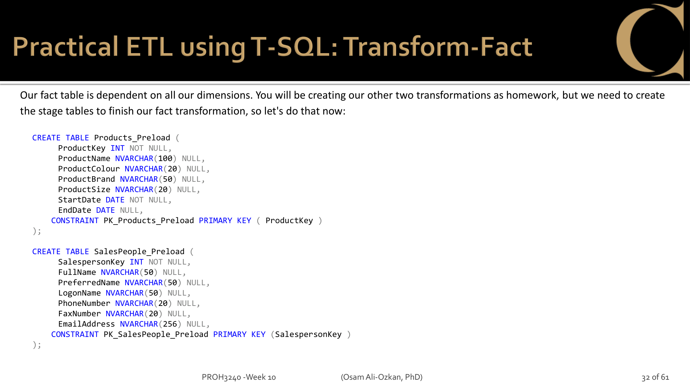

### Orders Transform (FactSales)

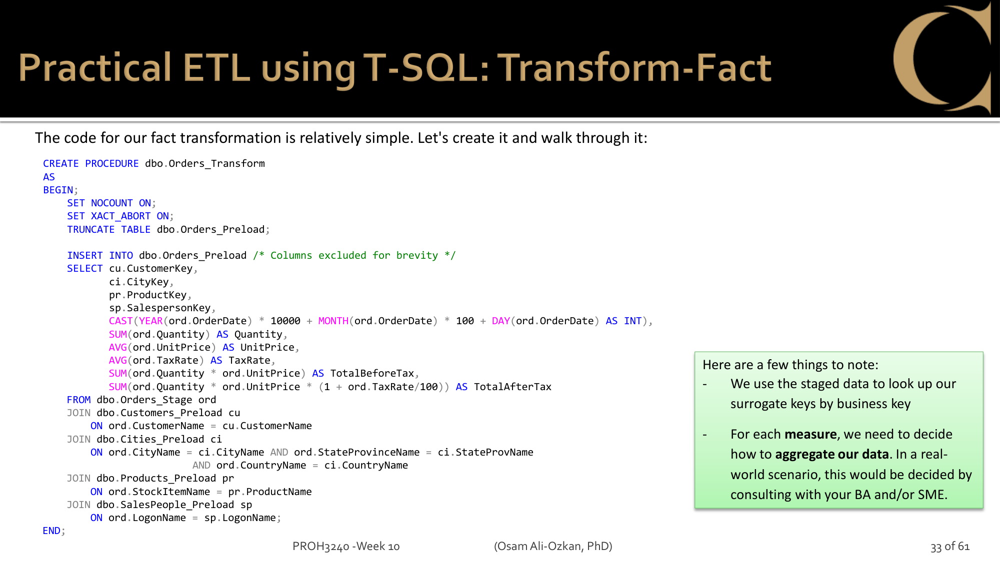

- Look up surrogate keys from PreLoad tables using business keys
- Aggregate measures: SUM(Quantity), AVG(UnitPrice), AVG(TaxRate), SUM(TotalBeforeTax), SUM(TotalAfterTax)
- DateKey = YYYYMMDD Smart Key (calculated, not looked up)

### Homework

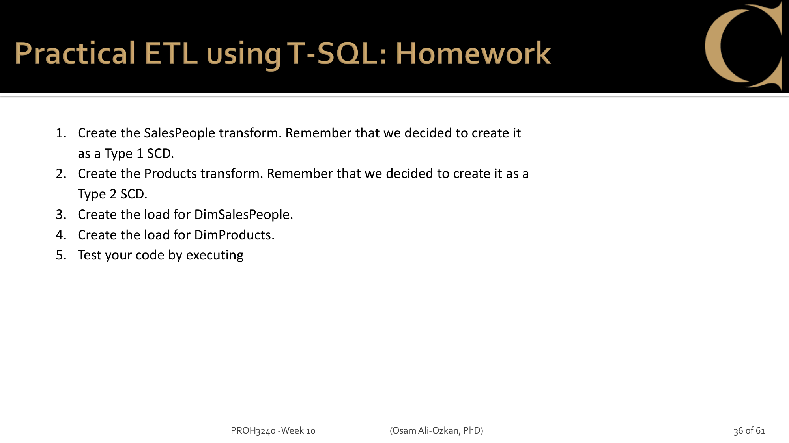

---

## T-SQL (Member A)

6 Transform SPs + PreLoad tables + Sequences:

**Sequences:**
- `dbo.LocationKey`, `dbo.CustomerKey`, `dbo.ProductKey`, `dbo.SalespersonKey`, `dbo.SupplierKey`

**Location_Transform** (Type 1) — class example at p.25
**Customers_Transform** (Type 2) — class example at p.29-30
**Products_Transform** (Type 2) — homework, same pattern as Customers
**SalesPeople_Transform** (Type 1) — homework, same pattern as Location
**Suppliers_Transform** (Type 2) — assignment addition, same pattern as Customers
**Orders_Transform** (FactSales) — class example at p.33

Validation: if Stage table is empty, RAISERROR or PRINT error message.

---

## Python (Member B)

Same Transform logic via pyodbc:
1. Read from Stage table
2. Read existing Dim records from DW
3. Compare business keys — determine which case (a/b/c/d for Type 2)
4. Write to PreLoad table

At least 1 Transform must be implemented in Python.

---

## SSIS (Member C)

Transform in SSIS uses:
- **Lookup** component — match Stage records to existing Dim records by business key
- **Conditional Split** — branch on match/no-match
- **OLE DB Command** — UPDATE for expiration
- **OLE DB Destination** — INSERT new records

At least 1 Transform must be implemented in SSIS.
