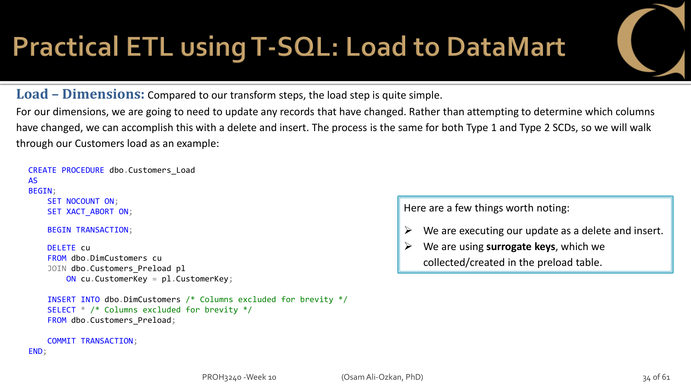
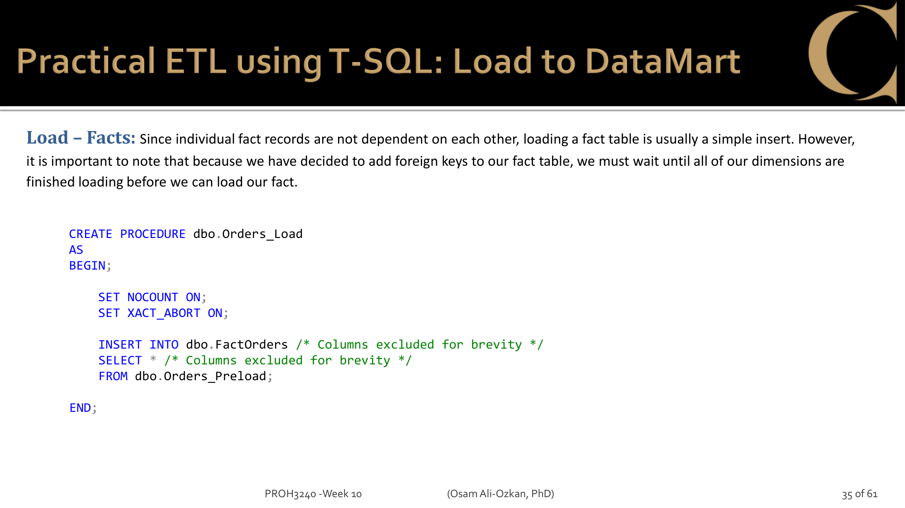

# Req 6: ETL Loads (4 marks)

> Load = move data from PreLoad tables into final Dim/Fact tables. T-SQL only.

---

## What is Load?

Transform wrote clean, surrogate-keyed data into PreLoad tables.
Load is the final step: **move that data into the actual Dim and Fact tables** that queries run against.

```
PreLoad tables              Final tables
┌──────────────────┐        ┌──────────────────┐
│ Customers_Preload│  Load  │ DimCustomers     │ ← queries read from here
│ Products_Preload │ ─────→ │ DimProducts      │
│ Location_Preload │        │ DimLocation      │
│ SalesPeople_Pre. │        │ DimSalesPeople   │
│ Suppliers_Preload│        │ DimSuppliers     │
│ Orders_Preload   │        │ FactSales        │
└──────────────────┘        └──────────────────┘
```

## Why separate Load from Transform?

- Transform is complex (SCD logic, key mapping). Load is simple (just move data).
- If Load fails, PreLoad data is still intact — just re-run Load.
- Load uses **transactions** — if part of the insert fails, everything rolls back to a clean state.

## Dim Load Pattern



**DELETE + INSERT** (not UPDATE):
1. BEGIN TRANSACTION
2. DELETE existing records that match PreLoad (by surrogate key)
3. INSERT all records from PreLoad
4. COMMIT (or ROLLBACK on error)

Why DELETE + INSERT instead of UPDATE?
- Simpler than figuring out which columns changed
- PreLoad already has the correct data — just replace

## Fact Load Pattern



**Simple INSERT:**
1. INSERT INTO FactSales SELECT * FROM Orders_Preload
2. No DELETE needed — facts are additive (new rows, never update existing)

## Execution Order

1. **Dim tables first** (DimCustomers, DimProducts, DimLocation, DimSalesPeople, DimSuppliers)
2. **Fact table last** (FactSales has FK references to all Dims)

If you load FactSales before Dims → FK violation error.

## Transaction Safety

Assignment says: "if part of the updates for a table fail, the rest of the updates to the table will be rolled back."

```sql
BEGIN TRY
    BEGIN TRANSACTION;
    -- DELETE + INSERT
    COMMIT TRANSACTION;
END TRY
BEGIN CATCH
    ROLLBACK TRANSACTION;
    THROW;
END CATCH
```

Each Load SP wraps its work in a transaction. If any error occurs mid-load, the entire table load is rolled back — no partial data.

## Load SPs to create

| SP | Target | Type |
|----|--------|------|
| Customers_Load | DimCustomers | DELETE + INSERT |
| Products_Load | DimProducts | DELETE + INSERT |
| Location_Load | DimLocation | DELETE + INSERT |
| SalesPeople_Load | DimSalesPeople | DELETE + INSERT |
| Suppliers_Load | DimSuppliers | DELETE + INSERT |
| Orders_Load | FactSales | INSERT only |

Execution order: all Dim Loads first, then Orders_Load.
