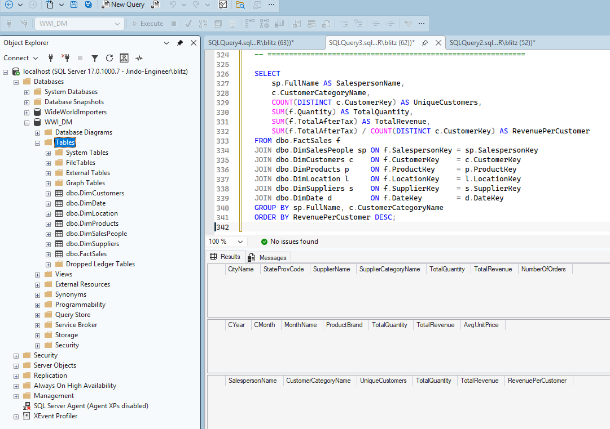
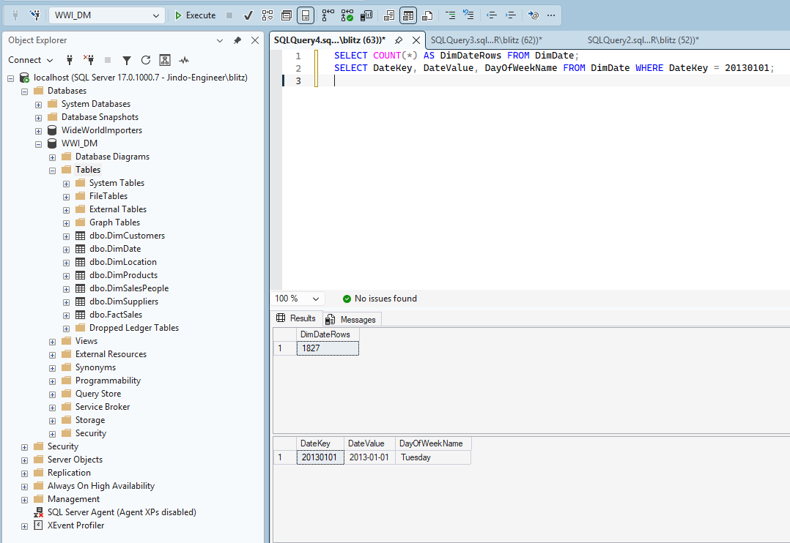
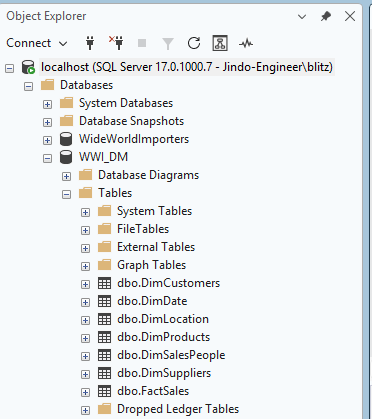

# Part 1 — SSMS Verification

`Part1_Group11.sql` executed top-to-bottom in SSMS against fresh WWI_DM.

## Result 1: Full script execution (Req 1 + Req 3)

Ran entire Part1_Group11.sql in one go:
- Req 1: 7 tables created (visible in Object Explorer)
- Req 3: 3 queries executed — 0 rows (FactSales empty), no SQL errors
- "Query executed successfully"



## Result 2: DimDate verification (Req 2)

```sql
SELECT COUNT(*) AS DimDateRows FROM DimDate;
SELECT DateKey, DateValue, DayOfWeekName FROM DimDate WHERE DateKey = 20130101;
```

- 1,827 rows (2012-01-01 ~ 2016-12-31)
- 20130101 = Tuesday ✅



## Result 3: Tables in Object Explorer (Req 1)

All 7 tables visible after execution:



---

All checks passed. Part1_Group11.sql runs top-to-bottom without errors.
